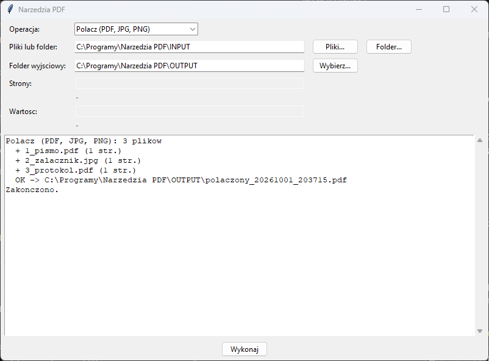

# Narzędzia PDF

Program **lokalny** — działa w całości na Twoim komputerze i nigdzie nie
wysyła plików. Zastępuje internetowe serwisy typu „połącz PDF online”, do
których trafiają dokumenty z danymi osobowymi.



## Operacje

| Operacja | Pole „Strony” | Pole „Wartość” | Wynik |
|----------|---------------|----------------|-------|
| **Połącz (PDF, JPG, PNG)** | – | – | `polaczony_RRRRMMDD_GGMMSS.pdf` |
| **Podziel** | `1-3,4-6` → dwa pliki; puste → każda strona osobno | – | `nazwa_str1-3.pdf`, … |
| **Wybierz strony** | `1,3,5-7` (w podanej kolejności) | – | `nazwa_wybrane.pdf` |
| **Usuń strony** | `2,5-6` | – | `nazwa_bez_stron.pdf` |
| **Obróć** | puste = wszystkie | `90` / `180` / `270` | `nazwa_obrocony.pdf` |
| **Kompresuj** | – | jakość JPEG 1–100 (domyślnie 60) | `nazwa_skompresowany.pdf` |
| **Numeruj strony** | puste = wszystkie | format, domyślnie `Strona {n} z {N}` | `nazwa_numerowany.pdf` |
| **Znak wodny** | puste = wszystkie | tekst, domyślnie `KOPIA` | `nazwa_znak_wodny.pdf` |

Zakresy stron: `1-3` (od 1 do 3), `5` (jedna strona), `8-` (od 8 do końca),
`-4` (od początku do 4), łączone przecinkiem. Strony liczone są od 1.

Wskazany **folder** jest przetwarzany w całości: każdy plik osobno, a przy
łączeniu wszystkie razem, w kolejności alfabetycznej. Jeśli kolejność
łączenia ma znaczenie, nazwij pliki `01_…`, `02_…`. Przy wyborze kilku
plików przyciskiem **Pliki…** kolejność ustala okno wyboru.

### Szczegóły

- **Łączenie** przyjmuje też zdjęcia i skany (JPG, PNG, BMP, TIFF). Każdy
  obraz staje się jedną stroną, co przydaje się przy skanach z telefonu.
- **Kompresja** zmniejsza obrazy powyżej 200 DPI do 150 DPI i zapisuje je
  jako JPEG z podaną jakością. Najwięcej daje przy skanach. Jeśli plik jest
  już zoptymalizowany i wynik wyszedłby większy, zapisywana jest kopia bez
  zmian.
- **Numeracja i znak wodny** obsługują polskie znaki (czcionka Arial
  z Windows) i poprawnie układają się na stronach obróconych i poziomych.
- **Oryginały nigdy nie są zmieniane.** Wyniki trafiają do folderu
  wyjściowego.

## Instalacja (jednorazowo)

1. **Python** — pobierz z [python.org](https://www.python.org/downloads/windows/)
   (wersja 3.9 lub nowsza). W instalatorze zaznacz **„Add python.exe to PATH”**.
   Opcja „tcl/tk and IDLE” jest zaznaczona domyślnie i musi taka zostać.
   Uprawnienia administratora nie są potrzebne.
2. **Program** — na stronie [github.com/DawidBochno/Narzedzia-PDF](https://github.com/DawidBochno/Narzedzia-PDF)
   kliknij zielony przycisk **Code → Download ZIP**. Rozpakuj archiwum,
   np. do `C:\Programy\Narzedzia PDF`. Nie uruchamiaj programu z wnętrza ZIP-a.
3. Kliknij dwukrotnie **`install.bat`**. Instaluje bibliotekę `PyMuPDF` (potrzebny internet) i uruchamia test. Na końcu pojawia się
   **„selftest OK”**, co znaczy, że wszystko działa.
   Jeśli Windows pokaże „System Windows ochronił ten komputer”, kliknij
   **Więcej informacji → Uruchom mimo to**.
4. Program uruchamia się plikiem **`uruchom.bat`**. Wygodnie jest zrobić
   skrót na pulpicie: prawy przycisk na `uruchom.bat` → **Wyślij do →
   Pulpit (utwórz skrót)**.

## Jak używać

1. Uruchom `uruchom.bat`.
2. **Operacja** — wybierz z listy, co zrobić (tabela [Operacje](#operacje)).
3. **Pliki lub folder** — **Pliki…** pozwala zaznaczyć kilka plików
   naraz (z Ctrl), **Folder…** bierze wszystkie pliki z folderu.
4. **Strony** i **Wartość** — wypełnij, jeśli operacja ich potrzebuje,
   np. `1-3,5` przy wyborze stron albo `90` przy obracaniu. Puste pole
   oznacza wartość domyślną.
5. Kliknij **Wykonaj**. Wyniki trafiają do folderu wyjściowego
   (domyślnie `OUTPUT`), a oryginały zostają bez zmian.

## Aktualizacje

Po uruchomieniu program sprawdza w tle na GitHubie, czy jest nowa wersja.
Jeśli jest, pyta **„Pobrać i zainstalować teraz?”**. Pobierane są tylko
zmienione pliki programu. Foldery `INPUT`, `OUTPUT`, ustawienia i pliki
w `przyklad/` nie są nadpisywane. Po aktualizacji zamknij i uruchom program ponownie. Jeśli program
o to poprosi, uruchom też raz `install.bat` (zmieniły się biblioteki).

- Do GitHuba trafia tylko zapytanie o listę plików programu, **nigdy
  dokumenty ani dane**.
- Bez internetu albo przy blokadzie (np. UTM) program działa normalnie,
  bez żadnego komunikatu.
- **Wyłączenie** (np. gdy programy aktualizuje dział IT): utwórz w folderze
  programu pusty plik o nazwie `NIE_AKTUALIZUJ`.
- Kopię pobraną przez `git clone` aktualizuje się poleceniem `git pull`.

## Ograniczenia

- PDF zabezpieczony hasłem trzeba najpierw odbezpieczyć.
- Kompresja nie zmniejszy PDF-ów zawierających sam tekst, bez obrazów,
  bo nie ma w nich czego zmniejszać.
- Znak wodny jest dodawany jako tekst na stronie, a nie jako zabezpieczenie.
  Da się go usunąć w edytorze PDF.

## Testy

```bash
python narzedzia_pdf.py --selftest
```

Test sprawdza parsowanie zakresów stron (także błędnych) i każdą operację
na wygenerowanym PDF-ie, w tym łączenie PDF z obrazem PNG i polskie znaki
w znaku wodnym.
